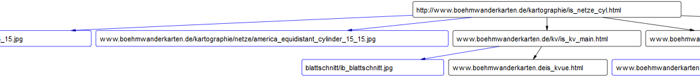

# C++ web crawler  

This project is a web crawler written in C++ with a fellow student. It analyzes recursive the html code of a given website and collects all links and images. When all links and images are collected the crawler saves the analyzed structure in a file as DOT format as shown in the picture.  

If you have questions or want to report a bug, please send an email to tobiasfox@gmx.net.
